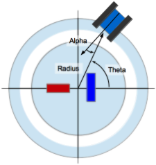
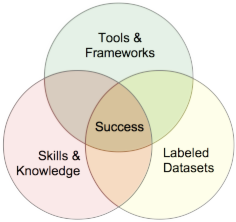
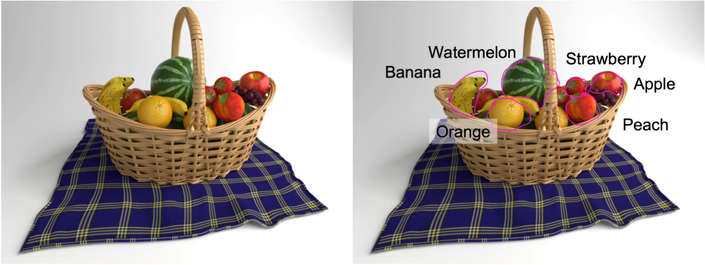
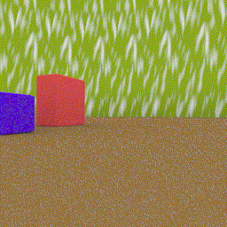

# Convolutional Neural Network + Robotics = ConvoBot
ConvoBot brings together a number of related areas of interest for me in Robotics _(Hobby)_; engineering, software development _(Work Experience)_; solving problems using data _(Data Science)_.  The overarching goal of the project is to enable autonomous location and control of a robot relative to it's environment using Convolutional Neural Networks (CNN).  My Capstone work during the Galvanize Data Science Immersive Program provided an opportunity to get the Data Science side of the project kicked off.  It also opened up a very interesting opportunity to explore how simulated environments can be used to explore feature space, better understand the dynamics of neural networks, and decouple knowledge and skills learning from the dynamics and slow pace of the physical world.

<b>Figure 1: </b>Hierarchy of topics in scope for ConvoBot.

## Table of Contents
1. [Overview](#overview)
2. [Convolutional Neural Networks](#convolutional-neural-networks)
   * [Limiting Factors](limiting-factors)
   * [Exploring Model and Feature Space](exploring-model-and-feature-space)
3. [Labeling](labeling)
4. [ConvoBot Simulation](convobot-simulation)

## Overview
ConvoBot will be equipped with a fixed camera facing forward.  Based on the images captured and the well know red and blue target blocks, the CNN should be able to predict the location of ConvoBot.  Position is defined by:
* <b>Radius</b> - distance from the center of the environment.
* <b>Theta</b> - the angular displacement from the X-axis.
* <b>Alpha</b> - The angular displacement of the forward facing camera from the radial line back to the center of the environment.

<b>Figure 2: </b>Environment and location parameters.

## Convolutional Neural Networks
Convolutional Neural Networks (CNN) are a powerful machine learning tool that has become very powerful and popular in the last decade.  Highly visible research combine with increases in computer power, labeled datasets, prize based competitions are all driving exponential growth in CNN research and applications. CNN are widely used in some of these fields:
* <b>Voice Recognition</b> - Siri, Cortana, Alexa
* <b>Text Translation and Transcribing</b> - Google Translate
* <b>Autonomous Cars</b>
* <b>Biology & Drug Discovery</b>
* <b>Finance, Fraud Detection</b>
* <b>Astronomy</b>
* <b>Robotics</b>

### Limiting Factors
One of the big constraints that is impacting Neural Network (NN) research and development is access to very-large labeled datasets _(10's of millions)_ .  NN are not designed and coded like traditional software solutions for a specific problem.  The are designed with some general guiding principles and then learn the details through training with the large labeled datasets.  Access to large labeled datasets may be difficult to acquire or costly to create. This is particularly the case with image data the domain of CNN.  

Researchers and developers have a number of tricks of their sleeves to extend existing datasets, but there are limits on how far we can push the flip, rotate, crop, translate methods.

### Exploring Model and Feature Space
Given a labeled dataset we can perform a number of search techniques to find the best combination of NN layer design, and hyper-parameters to tune the networks for best performance with validation and future data.  These techniques are reasonably well understood, but may be costly to compute over many runs on the training data.

In an effort to address the shortage of labeled image datasets simulations are being used an increasing number of situations.  Simulated datasets can help address:
* No labeled data for a particular domain
* In ability to capture a labeled dataset do to cost or risk
* Explore model characteristics under varying input data

Successful NN projects are dependent on three key capabilities.
* Powerful, flexible and accessible tools and frameworks
* Large labeled datasets
* Individuals with the right skills and knowledge

<b>Figure 3: </b>Elements for Neural Network Success.

Through the use of simulations, we are able to generate new and interesting labeled datasets to train NN.  Simulations do have their limitations, but they do have their uses, particularly in the individual education and learning environments.

#### limitations
* Fidelity with the real world
  * Artifacts in images
  * Level of details

#### Opportunities
* Lighting
* Fill in gaps / extend in real world datasets
* Explore robustness of trained NN
* Rapid prototyping and testing
* Avoid physical world development before proof of concept with simulation

## Labeling
Labeling images is time consuming and error prone.  There are any number of war stories of researchers spending significant time labeling images just so they can complete a project.  It is so important that there are event online programs where you can contract people to label images for you.

Let's pretend that we want to develop a fruit classifier that can look at an image and tell us how many of what fruit are in the basket.  It is pretty easy for us to look at the basket and see some bananas, oranges, strawberry, watermelon, apple and peaches.  No problem that only takes a second or two - but wait, you need to identify the outline and attach the label to the regions.  Now picture doing that on 1000, 10,000 or a million images!  It make your mouse hand ache just thinking about it.

<b>Figure 3: </b>Elements for Neural Network Success.
[Credit to the creator](https://blenderartists.org/forum/showthread.php?437913-He-loves-me)

The good news is that that isn't a real picture of a fruit basket.   It is a high-definition rendering of a fruit basket from [Blender](https://www.blender.org/) an industry leading animation studio.  The artist knows what everything is in the basket and where it is.  It isn't too hard to work from there to a fully labeled fruit basket.  Infact it isn't hard to generate 1000's of unique fruit baskets.

<b>Figure 4: </b>Simulation rendered examples Success.
[Credit to the creator](https://blenderartists.org/forum/showthread.php?438043-Challenge-743-Voting-CLOSED)

By extension you can easily see how we can create very realistic images through simulation.  We also have the ability to merge real 2D-images, simulated 3D-environments and other information gathered from different databases.

## ConvoBot Simulation
First, I'd like to tip my hat to the unbelievable images above.  There is an unbelievable level of skill and time invested to create those images.  That said, I'm just a beginner with Blender.  It took me a while to just get the two simple blocks in my simulation.  In fact that took longer than building the [SnakeShake](https://github.com/nathan5280/SnakeShake) remote procedure call integration built to drive Blender remotely with Python.

<b>Figure 5: </b>ConvoBot Target

  

 <b> Figure 6: </b> Radius 

  

 <b> Figure 7: </b> Theta 

  

 <b> Figure 8: </b> Alpha 
