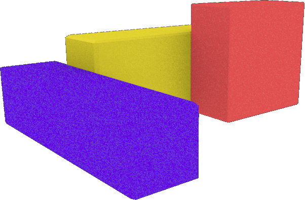
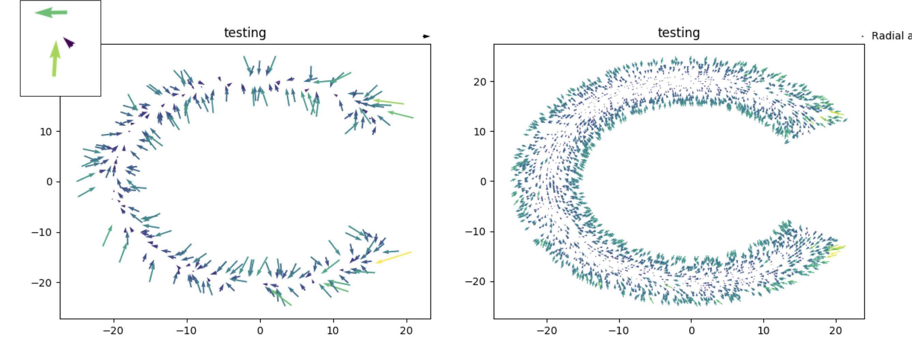

# ConvoBot = Convolutional Neural Network + Robotics 

    
    

ConvoBot brings together a number of related areas of interest for me in Robotics _(Hobby)_; engineering, software development _(Work Experience)_; solving problems using data _(Data Science)_.  The overarching goal of the project is to enable autonomous location and control of a robot relative to it's environment using Convolutional Neural Networks (CNN).  My Capstone work during the Galvanize Data Science Immersive Program provided an opportunity to get the Data Science side of the project kicked off.  It also opened up a very interesting opportunity to explore how simulated environments can be used to explore feature space, develop a better understand of the dynamics of neural networks, and decouple knowledge and skills learning from the constraints and slow pace of the physical world.

    

    <b>Figure 1: </b>Hierarchy of topics in scope for ConvoBot.

## Table of Contents
1. [Overview](#overview)
2. [Convolutional Neural Networks](#convolutional-neural-networks)
   * [Limiting Factors](limiting-factors)
   * [Exploring Model and Feature Space](exploring-model-and-feature-space)
3. [Labeling](labeling)
4. [ConvoBot Simulation](convobot-simulation)
5. [Simulation Examples](simulation-examples)
   * [Stereoscopic Vision](stereoscopic-vision)
6. [Error Plots](error-plots)
7. [Capstone](capstone-poster)

## Overview
ConvoBot will be equipped with a fixed camera facing forward.  Based on the images captured and the well know red, blue and yellow target blocks, the CNN should be able to predict the location of ConvoBot.  The initial target is quite simple so it can be easily replicated in the simulated and real world environments.  

Position is defined by:
* <b>Radius</b> - distance from the center of the environment.
* <b>Theta</b> - the angular displacement from the X-axis.
* <b>Alpha</b> - The angular displacement of the forward facing camera from the radial line back to the center of the environment.

    

    <b>Figure 2: </b>Environment and location parameters.

## Convolutional Neural Networks
Convolutional Neural Networks (CNN) are a powerful machine learning tool that has become popular in the last decade.  Highly visible research combine with increases in computer power, labeled datasets, and prize based competitions are all driving exponential growth in CNN research and applications. CNN are widely used in some of these fields:
* Voice Recognition - Siri, Cortana, Alexa
* Text Translation and Transcribing - Google Translate
* Autonomous Cars
* Biology & Drug Discovery
* Finance, Fraud Detection
* Astronomy
* Robotics

### Limiting Factors
One of the big constraints that is impacting Neural Network (NN) research and development is access to very-large labeled datasets _(1-10's of millions)_ .  NN are not designed and coded like traditional software solutions where they are hand coded to solve a specific problem.  They are designed with some general guiding principles and then learn the details through training with the large labeled datasets.  Access to large labeled datasets may be difficult to acquire or costly to create. This is particularly the case with image data - the target domain of CNN.  

Researchers and developers have a number of tricks of their sleeves to extend existing datasets, but there are limits on how far we can push these flip, rotate, crop, translate methods.

### Exploring Model and Feature Space
Given a labeled dataset we can perform a number of search techniques to find the best combination of NN layer design, and hyper-parameters to tune the networks for best performance with validation and future data.  These techniques are reasonably well understood, but may be costly to compute over many runs on the training data.

In an effort to address the shortage of labeled image datasets, simulations are being used in an increasing number of situations.  Simulated datasets can help address:
* No labeled data for a particular domain
* In capturiong a labeled dataset is prohibited due to cost or risk
* Explore model characteristics under by varying parameters in feature space

Successful NN projects are dependent on three key capabilities.
* Powerful, flexible and accessible tools and frameworks
* Large labeled datasets
* Individuals with the right skills and knowledge

    

    <b>Figure 3: </b>Elements for Neural Network Success.

Through the use of simulations, we are able to generate new and interesting labeled datasets to train NN.  Simulations do have their limitations, but they do have their uses, particularly in the individual education and learning environments.

#### Limitations
* Fidelity with the real world
  * Artifacts in images
  * Level of details

#### Opportunities
* Lighting
* Fill in gaps / extend in real world datasets
* Explore robustness of trained NN
* Rapid prototyping and testing
* Avoid physical world development before proof of concept with simulation

## Labeling
Labeling images is time consuming and error prone.  There are any number of war stories of researchers spending their weekends and nights labeling images just so they can complete a project.  It is so important that there are event online programs where you can contract people to label images for you.

Let's pretend that we want to develop a fruit classifier that can look at an image and tell us how many of what fruit are in the basket.  It is pretty easy for us to look at the basket and see some bananas, oranges, strawberry, watermelon, apple and peaches.  No problem, that only takes a second or two - but wait, you need to identify the outline and attach the label to the regions.  Now picture doing that on 1000, 10,000 or a million images!  It makes your mouse hand ache just thinking about it.

    

    <b>Figure 4: </b>Elements for Neural Network: [Credit to the creator](https://blenderartists.org/forum/showthread.php?437913-He-loves-me)

The good news is that the above image isn't a real picture of a fruit basket.   It is a high-definition rendering of a fruit basket from [Blender](https://www.blender.org/) an industry leading animation studio.  The artist knows what everything is in the basket and where it is.  It isn't too hard to work from there to a fully labeled fruit basket.  In fact, it isn't hard to generate 1000's of unique fruit baskets.

    
    

    <b>Figure 6: </b>Simulation rendered examples: [Credit to the creator](https://blenderartists.org/forum/showthread.php?438043-Challenge-743-Voting-CLOSED)

By extension you can easily see how we can create very realistic images through simulation.  We also have the ability to merge real 2D-images, simulated 3D-environments and other information gathered from different databases.

## ConvoBot Simulation
First, I'd like to tip my hat to the unbelievable images above.  There is an unbelievable level of skill and time invested to create those images.  That said, I'm just a beginner with Blender.  It took me a while to just get the three simple blocks in my simulation.  In fact that took longer than building the [SnakeShake](https://github.com/nathan5280/SnakeShake) remote procedure call integration to drive Blender remotely with Python.

    

    <b>Figure 5: </b>Environment and location parameters.

      

     <b> Figure 6: </b> Theta 

      

     <b> Figure 7: </b> Radius 

      

     <b> Figure 8: </b> Alpha 

## Simulation Examples
### Steroscopic Vision
One of the goals of my Capstone Project was to demonstrate a concrete example of something that was easy to do with a simulation, but hard to do in the real world.  Stereoscopic vision is a change to the data we collect in feature space when we capture the images. 

ConvoBot does pretty good with predicting Theta, but struggles with the Radial distance.  This isn't a big surprise as we struggle with depth perception when we cover one eye.  The question on the table as, "what if ConvoBot had two eyes?"  I'm not aware of a publicly available real world image dataset of stereoscopic images. There sure isn't a million image stereoscopic version of [ImageNet](http://www.image-net.org/). We have ways to try and create stereoscopic images from 2D images, but it always suffers from skew and other artifacts that just don't make sense in the real world.  

In the simulated world, creating stereoscopic images is fairly straight forward. We can easily create stereoscopic images in several different forms.  In fact, if we want to know what the optimal spacing is for the two "eyes" we can simulate several different datasets with different spacings.  This was the concrete example I investigated.  

#### Creating a Stereoscopic Image Set
The process was straight forward:

1. Subclass a new Stereoscopic Simulation Processor and code it to create two images for each position.  The camera was offset by the "eye" spacing.
2. Add a Merge Processor to the pipeline to take these two images and stack them vertically on top of each other and resize to 128x128 so that we could work with the same CNN.  Stacking the stereoscopic images in this way was a shortcut because ConvoBot is only working in 2D space.
3. Spin up a new GPU instance on AWS and train with the stereoscopic images.
4. Wait until morning and see how the new network does at predicting ConvoBot's position.

**Results**
1. Stereoscopic CNN didn't turn out to be any better at predicting location than monoscopic CNN.  This is probably a result of the very simple simulated environment or the shallowness of the CNN that I'm currently training with.
2. It took less than 2 days to go from concept to result in the simulated environment.  In the real world this would have been expensive and time consuming.  It also would have been unpopular if it generated the same results as the simulation.
3. Leveraging the simulated environment allowed for a change to the feature space (stereoscopic images) at a very low cost.  Until I can show that a more complex environment or CNN can actually take advantage of stereoscopic images, I'm not buying, building and integrating multiple cameras on ConvoBot.

      
      

     <b> Figure 9: </b> Left and right images as seen from each "eye". 

      

     <b> Figure 10: </b> One possible input to the CNN from stereoscopic images. 

## Error Plots
There are two dimensions (not the same 2D operations of ConvoBot) that are used to understand the error in the CNN predictions.

1. Histogram of the distribution of the error between the ground-truth/labeled location and the predicted location.

      

     <b> Figure 11: </b>Prediction Error

2. The distribution of the error the 2D space where ConvoBot operates.  The arrows in the quiver plot start at the predicted location and point to the ground-truth/labeled location.  If ConvoBot moved from the along the arrow it would end up at the labeled location and have zero error.

      

     <b> Figure 12: </b>Error plots for Radius and Theta.  Arrow Tail=Actual, Tip=Predicted Location

**Notes**
1. It's not surprising that a review of the quiver plot shows that the bulk of the prediction errors are at the edge of the prediction area.   The CNN is predicting a continuous variable for the location of ConvoBot Radius & Theta in this plot and at the edge where there are no points beyond the location the CNN has problems.
    * One option to reduce this error is to predict in a slightly restricted area that doesn't include location right at the edge of the training area.
    
2. What the heck is the bite out of the right hand side of the error plot?  Theta isn't continuous as it moves through 360 and back to 0.  Thus error between 360 and 1 is huge compared to 359 and 360 even though they are both only 1 degree.  This causes significant issues with the error function and that drives the optimizer nuts.  Within the time constraints of the Capstone it was easiest to just not train or predict on either side of the discontinuity.
    * There are two ways to deal with this moving foward.
        a. Learn more about TensorFlow and fix the error function to calculate the 360-0 as only one degree of error.
        b. Convert the labels to X & Y coordinates and train on those as they are continuous in the 2D space of ConvoBot's operation.
        
#Capstone Poster

      

     <b> Figure 13: </b>Capstone Poster

